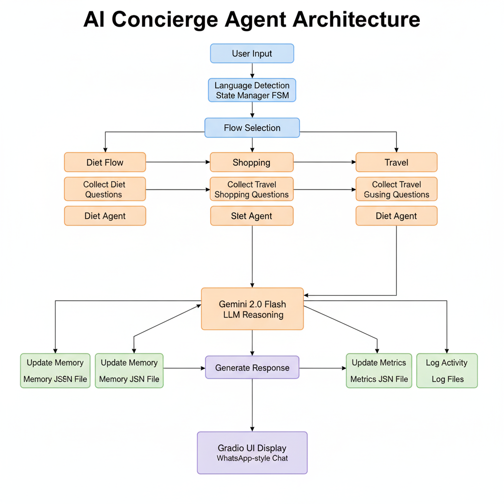
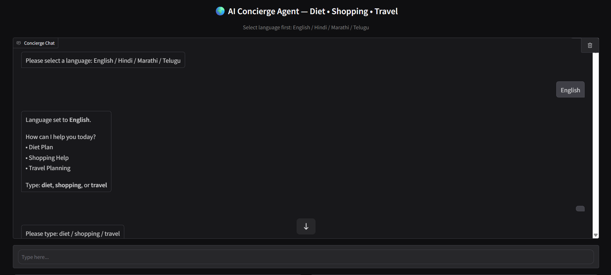
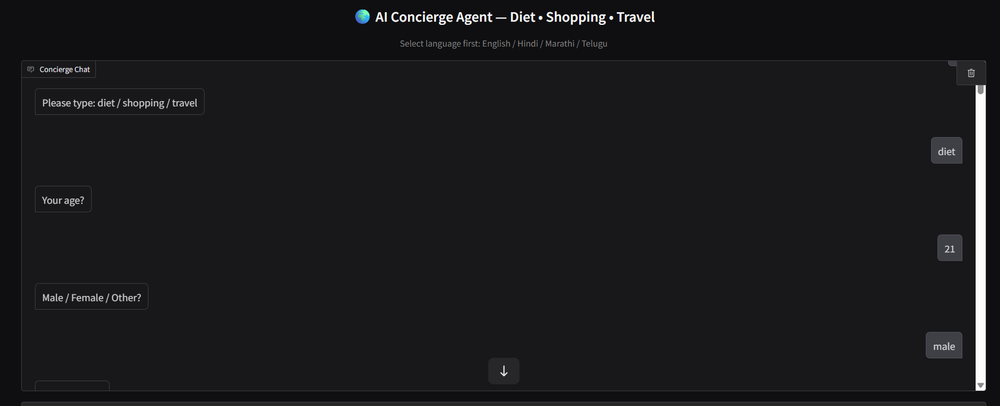
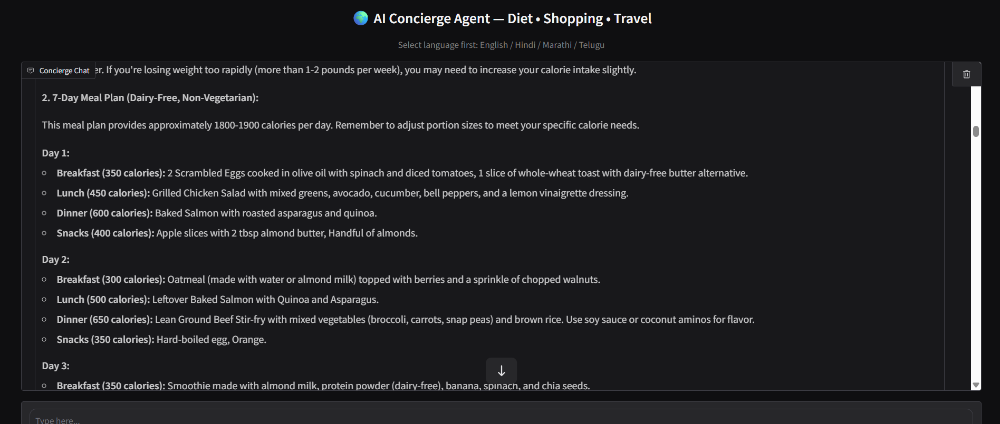
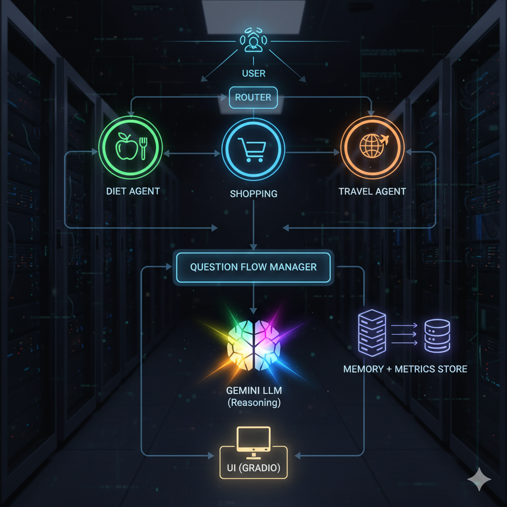

# 🌍 AI Concierge Agent — Diet · Shopping · Travel  
A multi-agent intelligent assistant built for the **Kaggle Agents Intensive Capstone Project** using **Gemini 2.0**, **Gradio**, and **persistent memory**.  
Helps users with **Diet Planning**, **Shopping Assistance**, and **Travel Planning** in multiple languages.

---

## 📌 Problem Statement  
People often struggle with:  
- Finding personalized **diet plans**,  
- Creating optimized **shopping lists**,  
- Planning **affordable travel** itineraries,  
- And switching between multiple tools to get this done.

This project solves all of these with **one unified AI agent**, available instantly.

---

## 📌 Why Agents?  
Agents are the perfect solution because they allow:  
- Autonomy → The agent collects required information step-by-step.  
- Multi-step decision making → It asks questions, stores answers, and produces final outputs.  
- Personalization → Memory ensures the agent “remembers” the user's preferences.  
- Structured workflows → Diet / Shopping / Travel each work as separate sub-agents.

---

## 🧠 Architecture Overview  

### **High-Level Architecture**




### **Components**
- **Router Agent** → Detects language + intent  
- **Diet Agent** → Calculates calories, plans 7-day meals, exercise  
- **Shopping Agent** → Makes optimized lists with budget  
- **Travel Agent** → Creates itineraries, costs, tips  
- **Memory Engine** → Saves preferences  
- **Metrics Engine** → Tracks usage  
- **Gemini Engine** → Generates responses  
- **Gradio UI** → WhatsApp-style interface  

---

## 🎥 Demo  
Live Try : https://huggingface.co/spaces/Pavan0281/concierge-agent

▶️ **Demo Video:** [watch Now](https://youtu.be/D-4Iu3MXunA?si=rNdydugeBepVZzIb)  

Screenshots:
 ### Screenshots:








---

## 🚀 Features  
### ✔️ Multilingual Support  
English, Hindi, Marathi, Telugu.

### ✔️ Multi-Agent System  
Separate workflows for:  
- Diet  
- Shopping  
- Travel  

### ✔️ Persistent Memory  
Stores:  
- Last diet preference  
- Last travel origin  
- Last shopping budget  

### ✔️ Self-Test System  
Includes:  
- Intent detection tests  
- Memory tests  
- Metrics tests  

### ✔️ Logging System  
Logs all steps into `concierge_agent.log`.

### ✔️ Metrics Tracking  
Tracks sessions, LLM calls, total messages.

---

## 🛠️ Tech Stack  
- **Python 3.10**  
- **Google Gemini 2.0 Flash** (via google-genai)  
- **Gradio**  
- **Kaggle Notebook Runtime**  
- **JSON Memory Storage**  
- **FastAPI + Uvicorn** (optional, for deployment)

---

## 📁 Project Structure  
```
AI-Concierge-Agent/
│
├── app/
│   ├── app.py                    # Main application
│   ├── assets/
│   │   ├── architecture.png      # Architecture diagram
│   │   ├── flow_diagram.png      # Flow diagram
│   │   └── thumbnail.png         # Project thumbnail
│   ├── memory/
│   │   ├── concierge_memory.json # User preferences storage
│   │   └── concierge_metrics.json# Usage metrics
│   ├── requirements.txt          # Python dependencies
│   └── runtime.txt              # Runtime configuration
│
├── docs/
│   └── Demo_Images/             # Demo screenshots
│      
├── .gitignore
└── README.md
```


---

## 🧩 How It Works 



### 1. User starts → selects a language  
### 2. Router detects intent  
### 3. Agent asks structured questions  
### 4. LLM generates full result  
### 5. Memory stores details for future requests  
### 6. Metrics log performance  

---

## 📦 Installation  
### **Clone the repo**
```bash
git clone https://github.com/PAVAN2627/AI-Concierge-Agent
cd AI-Concierge-Agent/app
```

### **Install packages**
```bash
pip install -r requirements.txt
```

### **Run the app**
```bash
python app.py
```


🌐 Deployment Options
1. Kaggle Notebook
Paste app.py → Run → Share URL.
2. HuggingFace Spaces
Upload folder → Select Gradio App → Set runtime.txt.


